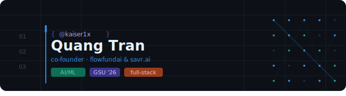

<div align="center">



# Hey, I'm Quang 👨‍💻

**Co-Founder @ [FlowFundAI](https://github.com/kaiser1x) & [savr.ai](https://github.com/kaiser1x)**  
Senior @ Georgia State University ('26) · Building at the intersection of AI & Finance

[](mailto:qdtran.dev@gmail.com)
[](https://github.com/kaiser1x)

</div>

---

### 🧠 About Me

I'm a builder obsessed with using AI to create smarter, faster, and more human tools. Currently in my Senior year at GSU while co-founding startups that blend intelligent systems with real-world financial and productivity problems.

- 🚀 **Co-Founder** of **FlowFundAI** — AI-augmented investing tools
- 💡 **Co-Founder** of **savr.ai** — rethinking how people manage money
- 🎓 **Senior** at Georgia State University · Class of '26
- 🤖 Passionate about **LLMs**, **agentic systems**, and **AI-first product design**
- 🌱 Always learning — currently deep in **multi-agent architectures**

---

### 🛠️ Tech Stack


---

### 📌 Current Focus

```
🏗️  Building AI-augmented tools at FlowFundAI & savr.ai
📚  Finishing my CS degree @ GSU ('26)
🔬  Exploring LLM agents, RAG pipelines & AI product design
💬  Open to collabs on AI-first projects
```

---

### 📊 GitHub Stats

<div align="center">


</div>

---

### 🤝 Let's Connect

I'm always open to collaborating on interesting AI projects or just talking shop about startups, tech, and building cool things.

📬 **[qdtran.dev@gmail.com](mailto:qdtran.dev@gmail.com)**

---

<div align="center">
  
</div>
