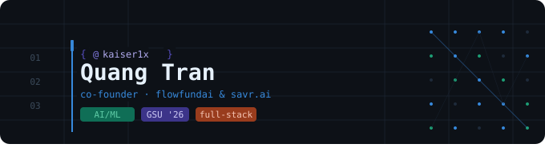

<div align="center">



# Quang Tran

**Founder · Software Engineer · Product Builder**

Building **Mob** — a social platform focused on bringing people and communities together.

Currently studying Computer Science at Georgia State University · Class of 2026

[Email](mailto:qdtran.dev@gmail.com) · [GitHub](https://github.com/kaiser1x) · [LinkedIn](https://www.linkedin.com/in/quang-tran-dev/)

</div>

---

## Building

### Mob

**Social · Community · AI**

Mob is my current startup and primary focus.

I'm building Mob from the ground up across product, engineering, infrastructure, and team development.

Currently focused on:

```text
Product        Designing the core experience
Engineering    Building the platform and infrastructure
AI             Intelligent and personalized experiences
Team           Building and leading the engineering team
Scale           Designing for real users from day one
```

> **Build the product. Build the team. Build the company.**

---

## Previously Built

A collection of products and experiments I've taken from idea to deployment.

### FlowFund AI

**AI-powered financial intelligence platform**

A financial platform designed to help users understand their spending, manage their finances, and make smarter investment decisions.

`React` `Node.js` `Python` `MySQL` `AI`

[View Project →](https://github.com/kaiser1x)

---

### savr.ai

**AI-powered meal planning assistant**

A system that analyzes grocery receipts and uses AI to generate personalized meal planning and food insights.

`React` `Node.js` `AWS Lambda` `Bedrock` `Textract` `DynamoDB` `S3`

[View Project →](https://github.com/kaiser1x)

---

### VibzCheck

**Collaborative music discovery platform**

A mobile application centered around discovering and sharing music with other people.

`Flutter` `Dart` `Firebase` `Spotify API`

[View Project →](https://github.com/kaiser1x)

---

### Aimsters / ReAim

**Machine learning × gaming**

An experimental platform analyzing mouse movement, reaction time, DPI, sensitivity, and aiming patterns to better understand player performance.

`React` `Node.js` `Python` `Machine Learning`

[View Project →](https://github.com/kaiser1x)

---

## Engineering

I enjoy working across the entire product lifecycle rather than staying within one layer of the stack.

```text
Product
    ↓
Architecture
    ↓
Frontend + Backend
    ↓
AI / Data
    ↓
Infrastructure
    ↓
Deployment
    ↓
Users
```

My current interests include:

**AI Systems**
LLM applications, agentic architectures, RAG, and AI-first product design.

**Product Engineering**
Building clean interfaces backed by reliable, production-ready systems.

**Infrastructure**
Cloud architecture, APIs, databases, authentication, deployment, and scalability.

**Startups**
Turning ideas into products, building engineering teams, and learning through shipping.

---

## Stack

```text
Languages
TypeScript · JavaScript · Python · Java · C

Frontend
React · React Native · Next.js

Backend
Node.js · Express · Python · REST APIs

Data
PostgreSQL · MySQL · MongoDB · DynamoDB

AI
OpenAI · AWS Bedrock · LLMs · RAG · AI Agents

Cloud
AWS · Docker · Supabase · Vercel · Railway
```

---

## Currently

```text
01  Building Mob
02  Leading engineering & product
03  Exploring AI-native social experiences
04  Building and deploying production systems
05  Finishing my Computer Science degree at GSU
```

---

## Let's Build

I'm interested in ambitious products, early-stage startups, AI, and engineering problems that are worth solving.

**If you're building something interesting, I'd love to hear about it.**

[qdtran.dev@gmail.com](mailto:qdtran.dev@gmail.com)

---

<div align="center">


</div>
